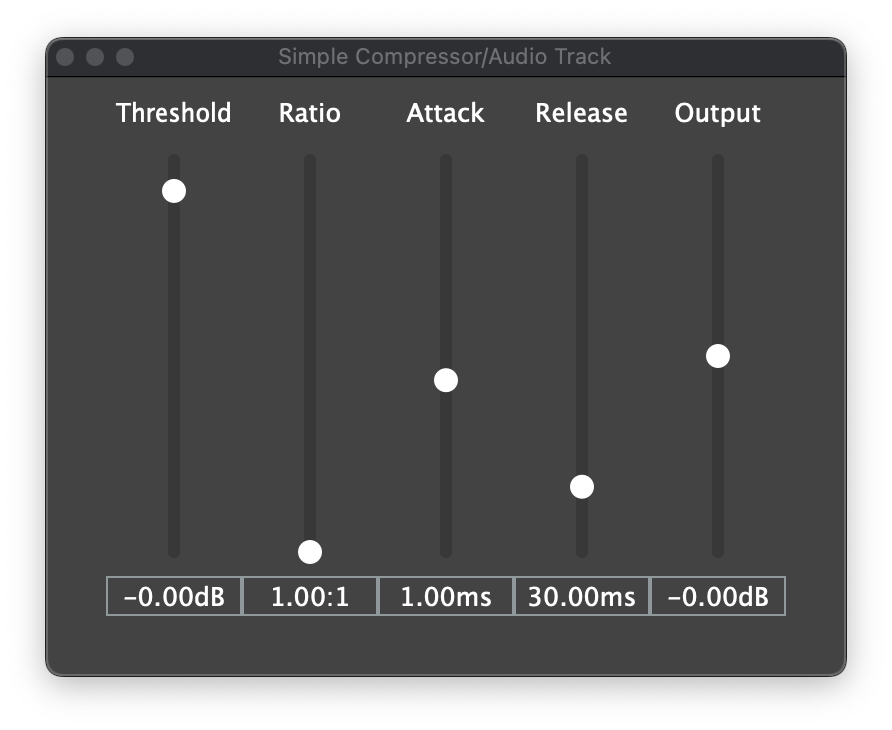

# Simple-Compressor

A compressor plugin made with JUCE, using JUCE DSP and with a custom LookAndFeel\
Download all files and open the .jucer with projucer, export to XCode and then build VST3.

### To do
- [x] Log scales for attack and release parameters
- [x] Simple GUI
- [ ] Create installer
